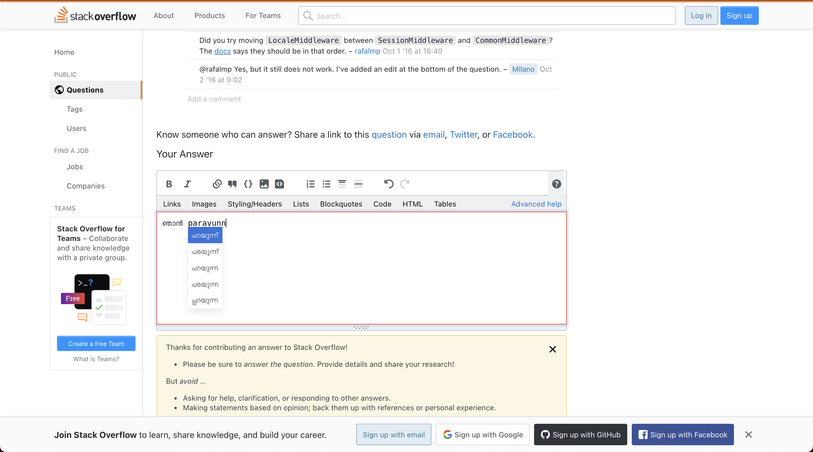

# Varnam Web extension

This is a web extension build over the varnam api. For every text or input field present in the webpage, the webextension makes it transliteratable.

## Usage
  

1. Clone the extension code to your local machine.  
2. Load the extension to the browser.  
   1. If using firefox go to [about:debugging#/runtime/this-firefox](about:debugging#/runtime/this-firefox) and load the manifest.json from your local machine to firefox.  
   2. If using chrome go to [chrome://extensions](chrome://extensions) and load the folder from your local machine to chrome.  
3. Once the extension is loaded, go to the input field or text area where you want the transliteration to be activated and then click the extension icon to activate transliteration.
4. A red border is added to show the extension is active.

## Improvements

[ ] The overlay of the dropdown gets hidden by html content or dropdown hides the editable element.
[ ] Add keyboard shortcut to work toggle an active element.  
[ ] A better way to show that the extension is active.

## Bugs
[X] It is always on, make this togglable.(high priority)  
[ ] It is only being invoked on page start, so if a change in page occurs that introudces a textarea or input field it is not being handled.  
[ ] Contenteditable field might have an issue (verify).